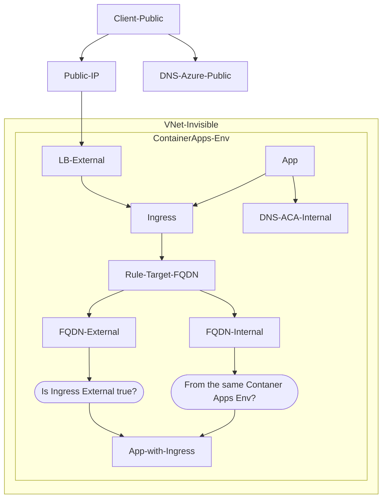

# Managed VNet

## Overview

## Access Pattern

| Ingress external | Source                 | Target FQDN                                                                 | Resolved Target IP                  |
|------------------|------------------------|-----------------------------------------------------------------------------|----------------------------|
| true             | Same Container App Env | <APP_NAME>.<UNIQUE_IDENTIFIER>.<REGION_NAME>.azurecontainerapps.io          | Container App Env Internal |
|                  |                        | <APP_NAME>.internal.<UNIQUE_IDENTIFIER>.<REGION_NAME>.azurecontainerapps.io | Container App Env Internal |
|                  | Public                 | <APP_NAME>.<UNIQUE_IDENTIFIER>.<REGION_NAME>.azurecontainerapps.io          | Public                     |
| false            | Same Container App Env | <APP_NAME>.internal.<UNIQUE_IDENTIFIER>.<REGION_NAME>.azurecontainerapps.io | Container App Env Internal |
